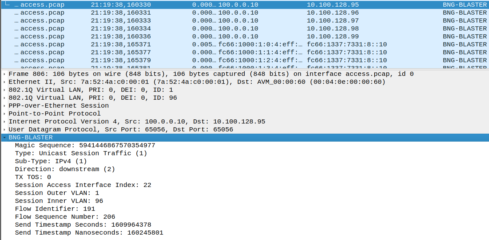

# Traffic

The BNG Blaster is able to emulate bidirectional unicast
session traffic for all addresses assigned to a session
(IPv4, IPv6 and IPv6PD).


There is also support to generate IPv4 multicast traffic.

## Blaster Header and Fast Decode Signature

The 48 Byte fixed size BNG Blaster Header is added to all data packets
for traffic validation and fast decoding. The header is expected on the
last 48 bytes of the packet.

The type is set to 1 for all unicast session traffic and 2 for
IPv4 multicast traffic.

### Unicast Session Traffic

The 64 bit session key is used for all traffic from access (upstream)
and to access (downstream) interfaces to identify the corresponding
session which has send or should receive the packet.

```
 0 1 2 3 4 5 6 7 8 9 0 1 2 3 4 5 6 7 8 9 0 1 2 3 4 5 6 7 8 9 0 1
+-+-+-+-+-+-+-+-+-+-+-+-+-+-+-+-+-+-+-+-+-+-+-+-+-+-+-+-+-+-+-+-+
| BNG Blaster Magic Sequence                                    |
|                                                               |
+-+-+-+-+-+-+-+-+-+-+-+-+-+-+-+-+-+-+-+-+-+-+-+-+-+-+-+-+-+-+-+-+
| Type          | Sub-Type      | Direction     | TX TOS        |
+-+-+-+-+-+-+-+-+-+-+-+-+-+-+-+-+-+-+-+-+-+-+-+-+-+-+-+-+-+-+-+-+
| Session Identifier                                            |
+-+-+-+-+-+-+-+-+-+-+-+-+-+-+-+-+-+-+-+-+-+-+-+-+-+-+-+-+-+-+-+-+
| Session Access Interface Index                                |
+-+-+-+-+-+-+-+-+-+-+-+-+-+-+-+-+-+-+-+-+-+-+-+-+-+-+-+-+-+-+-+-+
| Session Outer VLAN            | Session Inner VLAN            |
+-+-+-+-+-+-+-+-+-+-+-+-+-+-+-+-+-+-+-+-+-+-+-+-+-+-+-+-+-+-+-+-+
| Flow Identifier                                               |
|                                                               |
+-+-+-+-+-+-+-+-+-+-+-+-+-+-+-+-+-+-+-+-+-+-+-+-+-+-+-+-+-+-+-+-+
| Flow Sequence Number                                          |
|                                                               |
+-+-+-+-+-+-+-+-+-+-+-+-+-+-+-+-+-+-+-+-+-+-+-+-+-+-+-+-+-+-+-+-+
| Nanosecond Send Timestamp                                     |
|                                                               |
+-+-+-+-+-+-+-+-+-+-+-+-+-+-+-+-+-+-+-+-+-+-+-+-+-+-+-+-+-+-+-+-+
```



### Multicast Traffic

```
 0 1 2 3 4 5 6 7 8 9 0 1 2 3 4 5 6 7 8 9 0 1 2 3 4 5 6 7 8 9 0 1
+-+-+-+-+-+-+-+-+-+-+-+-+-+-+-+-+-+-+-+-+-+-+-+-+-+-+-+-+-+-+-+-+
| BNG Blaster Magic Sequence                                    |
|                                                               |
+-+-+-+-+-+-+-+-+-+-+-+-+-+-+-+-+-+-+-+-+-+-+-+-+-+-+-+-+-+-+-+-+
| Type          | Sub-Type      | Direction     | TX TOS        |
+-+-+-+-+-+-+-+-+-+-+-+-+-+-+-+-+-+-+-+-+-+-+-+-+-+-+-+-+-+-+-+-+
| Reserved                                                      |
+-+-+-+-+-+-+-+-+-+-+-+-+-+-+-+-+-+-+-+-+-+-+-+-+-+-+-+-+-+-+-+-+
| Source                                                        |
+-+-+-+-+-+-+-+-+-+-+-+-+-+-+-+-+-+-+-+-+-+-+-+-+-+-+-+-+-+-+-+-+
| Group                                                         |
+-+-+-+-+-+-+-+-+-+-+-+-+-+-+-+-+-+-+-+-+-+-+-+-+-+-+-+-+-+-+-+-+
| Flow Identifier                                               |
|                                                               |
+-+-+-+-+-+-+-+-+-+-+-+-+-+-+-+-+-+-+-+-+-+-+-+-+-+-+-+-+-+-+-+-+
| Flow Sequence Number                                          |
|                                                               |
+-+-+-+-+-+-+-+-+-+-+-+-+-+-+-+-+-+-+-+-+-+-+-+-+-+-+-+-+-+-+-+-+
| Nanosecond Send Timestamp                                     |
|                                                               |
+-+-+-+-+-+-+-+-+-+-+-+-+-+-+-+-+-+-+-+-+-+-+-+-+-+-+-+-+-+-+-+-+
```

NOTE: All attributes except IP addresses in the Blaster Header are
stored in host byte order for faster processing
(LE or BE depending on test system).

### BNG Blaster Magic Sequence

The 64 bit magic sequence is the word `RtBrick!` decoded as ASCII:
```
0x5274427269636b21
```

The magic number allows to check for it on a given offset and process
only blaster header instead of decoding the whole packet for faster
packet processing.

### Flow Identifier

The 64 bit flow identifier is a global unique number which identifies
the flow.

### Flow Sequence Number

The 64 bit flow sequence number is sequential number starting with 1
and incremented per packet primary used to identity packet loss.

This number 0 means that sequencing is disabled.

### Nanosecond Send Timestamps

The 64 bit nanoseconds send timestamp is used for optional latency and
jitter calculations.

```
 0 1 2 3 4 5 6 7 8 9 0 1 2 3 4 5 6 7 8 9 0 1 2 3 4 5 6 7 8 9 0 1
+-+-+-+-+-+-+-+-+-+-+-+-+-+-+-+-+-+-+-+-+-+-+-+-+-+-+-+-+-+-+-+-+
| Seconds                                                       |
+-+-+-+-+-+-+-+-+-+-+-+-+-+-+-+-+-+-+-+-+-+-+-+-+-+-+-+-+-+-+-+-+
| Nano Seconds                                                  |
+-+-+-+-+-+-+-+-+-+-+-+-+-+-+-+-+-+-+-+-+-+-+-+-+-+-+-+-+-+-+-+-+
```

The timestamp 0 means that timestamps are disabled.

